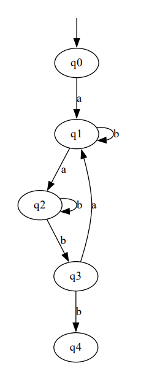

# LAB 2 LFAF

### Course: Formal Languages & Finite Automata
### Author: Bardier Andrei

----

## Theory
Nondeterministic Finite Automata (NFA) and Deterministic Finite Automata (DFA) are two types of finite automata used in the field of theoretical computer science. These are mathematical models that can recognize regular languages, which are a subset of formal languages.

An NFA is a machine that can be in multiple states at once, and it can transition from one state to another based on the input. The transition function of an NFA is not deterministic, meaning that for a given input and state, there can be multiple possible next states. This non-determinism makes it easier to design and implement an NFA, but it also makes it harder to analyze and reason about its behavior.

On the other hand, a DFA is a machine that can be in only one state at a time, and its transition function is deterministic. This determinism makes it easier to analyze and reason about the behavior of a DFA, but it also makes it harder to design and implement one.

The conversion of an NFA into a DFA is a fundamental problem in automata theory. The resulting DFA will have the same language as the original NFA, but it will have fewer states. This makes it easier to analyze and reason about the behavior of the automaton. The process of converting an NFA into a DFA involves creating a new DFA state for each set of NFA states that can be reached from the initial state using the same input symbol. The transition function of the DFA is then defined by applying the NFA transition function to each state in the set and taking the union of the resulting states.

Converting an NFA into a grammar is another fundamental problem in automata theory. The resulting grammar will generate the same language as the original NFA. The process of converting an NFA into a grammar involves creating a set of production rules that generate the strings accepted by the NFA. Each NFA state is associated with a non-terminal symbol in the grammar, and each transition in the NFA is associated with a production rule in the grammar. The final state of the NFA is associated with the start symbol of the grammar.

In summary, NFAs and DFAs are two types of finite automata used to recognize regular languages. While NFAs are easier to design, DFAs are easier to analyze. Converting an NFA into a DFA or a grammar is a fundamental problem in automata theory and can be used to simplify the analysis and design of automata-based systems.

## Objectives:
1. Understand what an automaton is and what it can be used for.

2. Continuing the work in the same repository and the same project, the following need to be added:
    a. Provide a function in your grammar type/class that could classify the grammar based on Chomsky hierarchy.

    b. For this you can use the variant from the previous lab.

3. According to your variant number (by universal convention it is register ID), get the finite automaton definition and do the following tasks:

    a. Implement conversion of a finite automaton to a regular grammar.

    b. Determine whether your FA is deterministic or non-deterministic.

    c. Implement some functionality that would convert an NFA to a DFA.
    
    d. Represent the finite automaton graphically (Optional, and can be considered as a __*bonus point*__):
      
    - You can use external libraries, tools or APIs to generate the figures/diagrams.
        
    - Your program needs to gather and send the data about the automaton and the lib/tool/API return the visual representation.
    
## Implementation description

The given program is an implementation of a Deterministic Finite Automaton (DFA) for a given context-free grammar. A DFA is a finite state machine that can accept or reject a string based on the transitions between the states and the input symbols.

The program uses two classes, Grammar and FiniteAutomaton, to represent the context-free grammar and the DFA respectively. The Grammar class takes the non-terminal variables (Vn), terminal variables (Vt), production rules (P), and the start symbol (S) as inputs, and it generates strings based on the given context-free grammar using a recursive function "generate_string". The class also converts the context-free grammar into a DFA using the "to_finite_automaton" function.

The FiniteAutomaton class takes five inputs: the set of states (Q), the alphabet (Sigma), the transition function (delta), the initial state (q0), and the set of final states (F). The class has a function "string_belongs_to_language" to check if the given input string belongs to the language defined by the DFA.

The main function generates 5 random strings from the grammar, checks if the strings belong to the language defined by the DFA, and finally tests the validation of a fixed string.


* Code snippets from your files.

```
    # Lab 1 data
    Vn = ["S", "D", "R"]
    Vt = ["a", "b", "c", "d", "f"]
    P = {
        "S": ["aS", "bD", "fR"],
        "D": ["cD", "dR", "d"],
        "R": ["bR", "f"]
    }
    S = "S"

    grammar = Grammar(Vn, Vt, P, S)

    # Lab 2
    Q = ('q0', 'q1', 'q2', 'q3', 'q4')
    alphabet = ['a', 'b']
    transition = {
        ('q0', 'a'): ['q1'],
        ('q1', 'b'): ['q1'],
        ('q1', 'a'): ['q2'],
        ('q2', 'b'): ['q2', 'q3'],
        ('q3', 'a'): ['q1'],
        ('q3', 'b'): ['q4'],
    }
    initial_state = 'q0'
    final_states = ['q4']

    # Grammar classification
    print("Grammar classification by Chomsky:", grammar.chomsky())
    print()

    # Creating of the new NFA
    automaton = N_FiniteAutomaton(Q, alphabet, initial_state, transition, final_states)

    # Convert NFA to grammar
    new_grammar = automaton.to_grammar()

    # NFA to DFA conversion
    dfa = automaton.nfa2dfa()
    
    # Graph
    automaton.draw_graph().view()
```
Output example:
```
Grammar classification by Chomsky: Type 3

________Automata to grammar________
Type of the automaton is NFA
Vn = ('q0', 'q1', 'q2', 'q3', 'q4')
Vt = ['a', 'b']
P = {'q0': ['aq1'], 'q1': ['bq1', 'aq2'], 'q2': ['bq2', 'bq3'], 'q3': ['aq1', 'bq4']}
S = q0
________NFA to DFA conversion________
Type of the automaton is DFA
Q = [['q0'], ['q1'], ['q2'], ['q3', 'q2'], ['q3', 'q2', 'q4']]
Sigma = ['a', 'b']
Delta =
(('q0',), 'a') = ['q1']
(('q1',), 'a') = ['q2']
(('q1',), 'b') = ['q1']
(('q2',), 'b') = ['q3', 'q2']
(('q3', 'q2'), 'a') = ['q1']
(('q3', 'q2'), 'b') = ['q3', 'q2', 'q4']
(('q3', 'q2', 'q4'), 'a') = ['q1']
(('q3', 'q2', 'q4'), 'b') = ['q3', 'q2', 'q4']
q0 = ['q0']
F = [['q3', 'q2', 'q4']]
___________________________________

Process finished with exit code 0

```
### Graphviz

Graphviz is a powerful tool for visualizing complex graphs and networks, including non-deterministic finite automata (NFA). In the provided code, the draw_graph method creates a directed graph using the Digraph class from the Graphviz library, which represents the states, transitions, and final states of an NFA.

To generate the graph, the method iterates over the set of states in the NFA and adds each one as a node to the graph. The initial state is added as a special node with no label, and an arrow pointing to the actual initial state. Final states are marked as double circle nodes, and transitions are represented as edges labeled with the input symbols.

This visualization can help users better understand the structure of an NFA, and quickly identify its properties, such as the set of reachable states and the acceptance of input strings. Moreover, Graphviz allows for customization of the graph's appearance, including node and edge colors, shapes, and styles, providing flexibility in representing complex NFAs in a clear and concise manner.

<p align="center">
    
</p>

## Conclusion

In conclusion, this project was a great opportunity to learn more about Formal Languages and Finite Automata. The project implemented the conversion of a finite automaton into a regular grammar, checked whether the automaton was deterministic or non-deterministic, and implemented the functionality to convert an NFA to a DFA. Additionally, the project included representing the finite automaton graphically.

The program implemented a Grammar class that generated strings based on the given context-free grammar and a FiniteAutomaton class that checked whether the input string belongs to the language defined by the DFA. These classes used the set of states, alphabet, transition function, initial state, and final states to perform their tasks.

The conversion of a finite automaton to a regular grammar and from NFA to DFA was implemented through an algorithm that involved creating a set of production rules associated with each state in the automaton.

The program used external libraries to generate diagrams and visual representations of the finite automaton.

Overall, the program fulfilled its objectives and allowed for a deeper understanding of Formal Languages and Finite Automata.